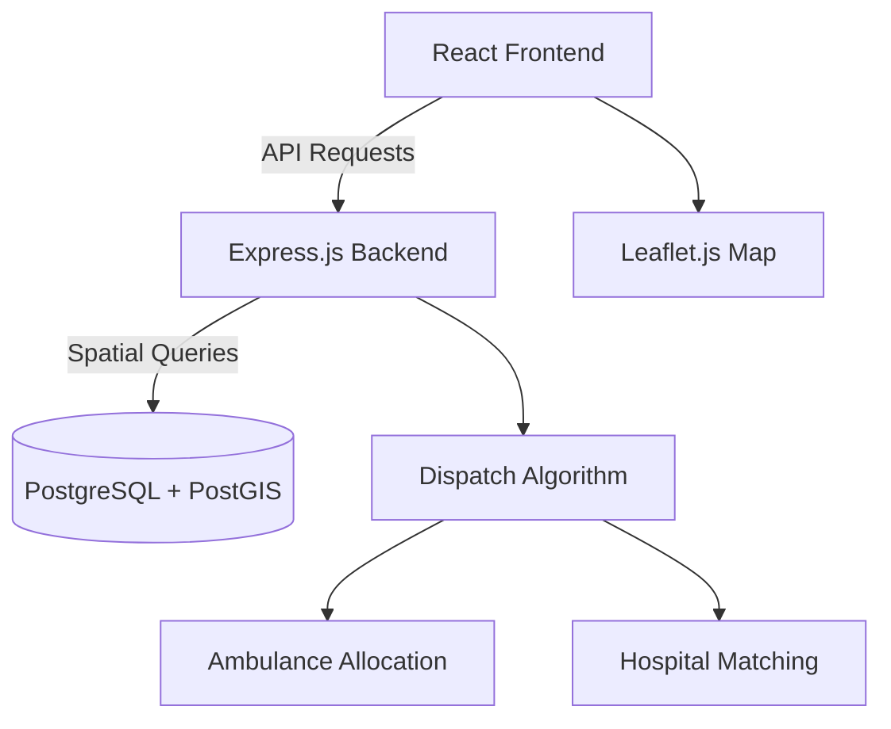

# 🚑 SwiftAid - Smart Emergency Response System

[](https://opensource.org/licenses/MIT)
[](https://nodejs.org/)
[](https://www.postgresql.org/)
[](https://nextjs.org/)

> 💡 **SwiftAid** is a comprehensive emergency dispatch platform that connects patients with the nearest available ambulances using **real-time geolocation, SMS notifications, and intelligent resource allocation.**

---

## 🌟 Highlights

* 🚨 **Intelligent Dispatch System** – Automatically assigns the nearest available ambulance using PostGIS spatial queries.
* 🏥 **Smart Hospital Selection** – Chooses the best hospital based on bed capacity, specialization, and proximity.
* 📊 **Real-Time Monitoring** – View live ambulance and emergency status updates on the dashboard.
* ⚙️ **Optimized Resource Management** – Efficient allocation of ambulances, drivers, and hospitals.
* 💻 **Full-Stack Implementation** – Node.js + PostgreSQL (PostGIS) backend with React.js frontend.

---

## 🧠 System Overview

### 🏗️ Architecture



### 🔍 Key Components

| Component                               | Description                                               |
| --------------------------------------- | --------------------------------------------------------- |
| 🧭 **Frontend (React)**                 | Interactive dashboard with Tailwind CSS & Leaflet.js maps |
| ⚙️ **Backend (Node.js)**                | Express.js REST API for all CRUD and dispatch logic       |
| 🗺️ **Database (PostgreSQL + PostGIS)** | Handles spatial queries, hospital/ambulance data          |
| 🧮 **Dispatch Engine**                  | Optimizes ambulance-hospital allocation                   |

---

## 🛠️ Tech Stack

| Layer               | Technology                         |
| ------------------- | ------------------------------------------------- |
| **Frontend**        | Next.js 15, React 18, TypeScript, TailwindCSS     |
| **Backend**         | Node.js, Express.js, Socket.IO, Twilio SMS        |
| **Database**        | PostgreSQL 14+, PostGIS 3.x                       |
| **UI Components**   | Radix UI, Framer Motion, Lucide React Icons       |
| **Maps & Charts**   | Leaflet.js, React-Leaflet, Chart.js               |
| **Testing & Tools** | Postman, Git                                      |

---

## 🚀 Quick Start

### 📋 Prerequisites
See **[REQUIREMENTS.md](REQUIREMENTS.md)** for detailed installation instructions for macOS, Windows, and Linux.

**Required:**
- Node.js 18+ & npm
- PostgreSQL 14+
- Git
- Twilio account (for SMS)

### 1️⃣ Clone Repository

```bash
git clone https://github.com/anika-dewari/SwiftAid.git
cd SwiftAid
```

### 2️⃣ Setup Database

```bash
psql -U postgres
CREATE DATABASE swiftaid_db;
\q

psql -U postgres -d swiftaid_db -f backend/schema.sql
```

### 3️⃣ Configure Backend

```bash
cd backend
npm install
cp .env.example .env
# Edit .env with your database and Twilio credentials
```

### 4️⃣ Configure Frontend

```bash
cd swiftaid-next
npm install
```

### 5️⃣ Run Application

```bash
# Terminal 1 - Backend (port 5001)
cd backend
npm run dev

# Terminal 2 - Frontend (port 3000)
cd swiftaid-next
npm run dev
```

Visit → **[http://localhost:3000](http://localhost:3000)**

---

## ⚙️ Core Features

| Feature                           | Description                                                |
| --------------------------------- | ---------------------------------------------------------- |
| 🚑 **Nearest Ambulance Finder**   | GPS-based matching using PostGIS ST_Distance               |
| 📱 **SMS Notifications**          | Twilio-powered alerts to drivers with emergency details    |
| 🏥 **Smart Hospital Selection**   | Considers distance, specialization & availability          |
| � **Medical Info Tracking**      | Captures patient allergies, medications, and notes         |
| 📡 **Real-time Updates**          | Live dashboard with Socket.IO WebSocket communication      |
| 🗺️ **Interactive Maps**          | Leaflet-based location tracking and visualization          |
| 🔐 **Role-based Access**          | User, Driver, and Admin authentication with JWT            |
| 🔄 **Resource Management**        | Full CRUD for hospitals, ambulances, and drivers           |
| 📊 **Dashboard Analytics**        | Charts and metrics for emergency response tracking         |

---

## 👩‍💻 Team Ananta

| Members          |
| ---------------- |
| **Anika Dewari** |
| **Ayush Negi**   |
| **Ritika Bisht** |

---

<p align="center">
  💡 *Developed with dedication by Team Ananta (B.Tech CSE, 3rd Year)* 💡
</p>

---

### 🧩 License

Licensed under the **MIT License** — free to use for academic and research purposes.

<p align="center">🚑 *SwiftAid — Saving Lives Through Intelligent Technology* 🚑</p>
