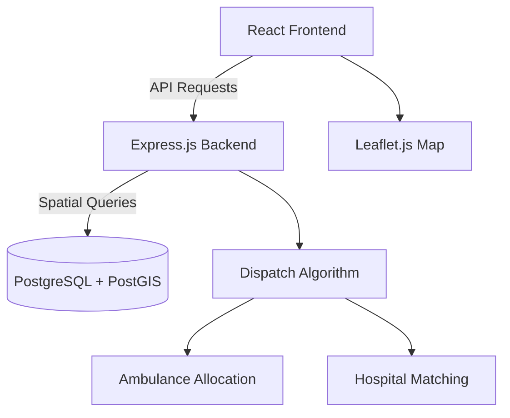

# 🚑 SwiftAid: Smart Emergency Dispatch & Resource Allocation System

[](https://opensource.org/licenses/MIT)
[](https://nodejs.org/)
[](https://www.postgresql.org/)
[](https://reactjs.org/)

> 💡 **SwiftAid** is an intelligent emergency dispatch system that optimizes ambulance allocation and hospital selection through **real-time data, spatial queries,** and **automated decision-making algorithms.**

---

## 🌟 Highlights

* 🚨 **Intelligent Dispatch System** – Automatically assigns the nearest available ambulance using PostGIS spatial queries.
* 🏥 **Smart Hospital Selection** – Chooses the best hospital based on bed capacity, specialization, and proximity.
* 📊 **Real-Time Monitoring** – View live ambulance and emergency status updates on the dashboard.
* ⚙️ **Optimized Resource Management** – Efficient allocation of ambulances, drivers, and hospitals.
* 💻 **Full-Stack Implementation** – Node.js + PostgreSQL (PostGIS) backend with React.js frontend.

---

## 🧠 System Overview

### 🏗️ Architecture



### 🔍 Key Components

| Component                               | Description                                               |
| --------------------------------------- | --------------------------------------------------------- |
| 🧭 **Frontend (React)**                 | Interactive dashboard with Tailwind CSS & Leaflet.js maps |
| ⚙️ **Backend (Node.js)**                | Express.js REST API for all CRUD and dispatch logic       |
| 🗺️ **Database (PostgreSQL + PostGIS)** | Handles spatial queries, hospital/ambulance data          |
| 🧮 **Dispatch Engine**                  | Optimizes ambulance-hospital allocation                   |

---

## 🛠️ Tech Stack

| Layer               | Technology                         |
| ------------------- | ---------------------------------- |
| **Frontend**        | React.js, Tailwind CSS, Leaflet.js |
| **Backend**         | Node.js, Express.js, Axios         |
| **Database**        | PostgreSQL 14+, PostGIS 3.x        |
| **Testing & Tools** | Postman, Git, JMeter (planned)     |

---

## 🚀 Quick Start

### 1️⃣ Clone & Install

```bash
git clone https://github.com/<your-username>/SwiftAid.git
cd SwiftAid/backend && npm install
cd ../frontend && npm install
```

### 2️⃣ Setup Database

```sql
CREATE DATABASE swiftaid_db;
\c swiftaid_db;
CREATE EXTENSION postgis;
```

### 3️⃣ Run Servers

```bash
# Backend
cd backend && npm start

# Frontend
cd frontend && npm start
```

Visit → **[http://localhost:3000](http://localhost:3000)**

---

## ⚙️ Core Features

| Feature                           | Description                                                |
| --------------------------------- | ---------------------------------------------------------- |
| 🚑 **Nearest Ambulance Finder**   | Uses Haversine formula & PostGIS ST_Distance for precision |
| 🏥 **Optimal Hospital Selection** | Considers distance, specialization & availability          |
| 📡 **Live Tracking (Planned)**    | Real-time ambulance movement via Socket.io                 |
| 🔄 **Resource CRUD APIs**         | Full CRUD for hospitals, ambulances, and drivers           |
| 🧾 **Analytics (Planned)**        | Response time metrics and performance tracking             |

---

## 👩‍💻 Team Ananta

| Members          |
| ---------------- |
| **Anika Dewari** |
| **Ayush Negi**   |
| **Ritika Bisht** |

---

<p align="center">
  💡 *Developed with dedication by Team Ananta (B.Tech CSE, 3rd Year)* 💡
</p>

---

### 🧩 License

Licensed under the **MIT License** — free to use for academic and research purposes.

<p align="center">🚑 *SwiftAid — Saving Lives Through Intelligent Technology* 🚑</p>
